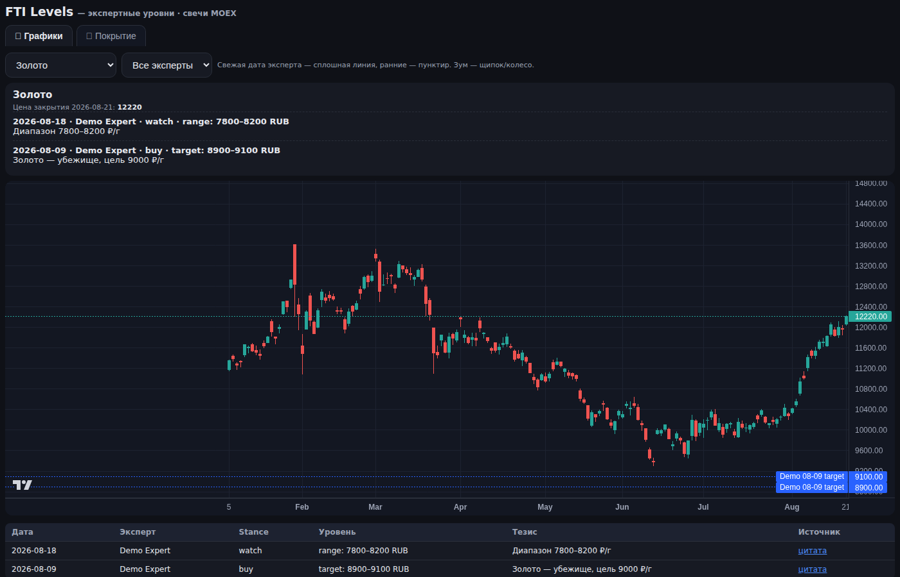

# financial-experts-said

[](https://clawhub.ai/bzsega/skills/financial-experts-said) [](https://github.com/bzSega/financial-experts-said/releases/tag/openclaw-v0.1.1)

**Financial experts talk every day. Do you remember a month later who promised IMOEX at 2000 — and whether it happened?**

**Финансовые эксперты говорят каждый день. А вы помните через месяц, кто обещал IMOEX 2000 — и сбылось ли?**

**Что говорили финансовые эксперты** — `financial-experts-said` превращает эфиры и посты экспертов в проверяемую историю: каждое заявление → уровень на графике → сверка с реальной ценой.

`financial-experts-said` turns expert YouTube streams and Telegram posts into a verifiable history: every statement → a level on the chart → comparison with the actual price.
---

## EN

### Who is it for
- You follow 3–10 financial experts (YouTube, Telegram) and want their calls on a single chart
- You want to recall who said what a week, a month, a year ago — every call here keeps its date, verbatim quote and link
- You want to understand which experts to trust, based on their track record against price

### What you get

- 📊 **Chart**: MOEX candles + expert levels (latest date — solid line, older — dashed), filters by asset × expert
- 🗂 **Coverage**: which expert talks about which assets, and how often
- 🔍 **Search**: «what did they say about Sber in June» — with verbatim quotes
- ✅ **Verifiable**: every thesis has expert, date, quote, source URL

### How it works
```
source (YouTube captions .srt/.vtt, Telegram post, article)
  → LLM extraction with canonical reference (anti-duplicates)
  → SQLite (theses, levels, assets, experts, sources)
  → interactive HTML chart / PNG
```

### Quickstart
```bash
git clone https://github.com/bzSega/financial-experts-said.git
cd financial-experts-said
python3 pipeline/init_db.py --db fti.db
python3 pipeline/seed_demo.py --db fti.db      # demo data
python3 chart/ticker_chart_html.py --db fti.db --out dashboard.html
```
Python 3.10+ is the only requirement for the pipeline; charts need internet (MOEX ISS API, lightweight-charts CDN).

### Distributions (pick yours)
| Runtime | Package | How to install |
|---|---|---|
| OpenClaw / ClawHub | `distrib/clawhub/` | `openclaw skills install` from [clawhub.ai/bzSega/financial-experts-said](https://clawhub.ai/bzSega/skills/financial-experts-said). ClawHub package is skills-only; install a matching, version-pinned repository runtime and set `FES_ROOT` ([references/runtime.md](distrib/clawhub/references/runtime.md)). Bundled runtime in Codex/Claude Code distributions does not extend to ClawHub. |
| Claude Code | `distrib/claude-code/` | `claude plugin marketplace add bzSega/financial-experts-said` (or copy `skills/` into `~/.claude/skills/`) |
| ChatGPT / Codex | `distrib/codex/` | see [distrib/codex/](distrib/codex/) — bundled Python runtime included |

Skills-only packages follow the open [AgentSkills](https://agentskills.io) standard: `SKILL.md` + `references/`. An AI agent given this repo link can pick the right `distrib/` subfolder on its own.

### Automating collection (tips)
- **Transcription**: for videos without subtitles, extract captions with `yt-dlp` (`--write-auto-srt`) or run a local Whisper; `.srt`/`.vtt` feed straight into `pipeline/captions_to_source.py`.
- **Telegram monitoring**: the [sergei-mikhailov-tg-channel-reader](https://clawhub.ai/bzSega/sergei-mikhailov-tg-channel-reader) skill reads public/private Telegram channels (posts, permalinks, unread tracking) and pairs perfectly with this pipeline.
- **Scheduling**: any cron works — check sources every N hours, index new material, deliver digests.

### Built with
Charts are built with [TradingView lightweight-charts](https://github.com/tradingview/lightweight-charts) (Apache License 2.0) via CDN.

### Under the hood
See [docs/architecture.md](docs/architecture.md): DB schema, extraction pipeline, 3-level anti-duplication (canonical reference in prompt → alias matching on import → semantic merge).

---

## RU

### Для кого
- Вы следите за 3–10 финансовыми экспертами (YouTube, Telegram) и хотите видеть их заявления на одном графике
- Вы хотите вспомнить, кто что говорил неделю, месяц, год назад — у каждого заявления здесь есть дата, дословная цитата и ссылка
- Вы хотите понимать, каким экспертам доверять — по их счёту против реальной цены

### Что вы получаете
- 📊 **График**: свечи MOEX + уровни экспертов (свежая дата — сплошная линия, ранние — пунктир), фильтры «актив × эксперт»
- 🗂 **Покрытие**: кто из экспертов про какие активы говорит и как часто
- 🔍 **Поиск**: «что говорили про Сбер в июне» — с дословными цитатами
- ✅ **Проверяемость**: у каждого тезиса — эксперт, дата, цитата, ссылка на источник

### Как это работает
```
первоисточник (субтитры YouTube .srt/.vtt, Telegram-пост, статья)
  → LLM-извлечение с каноническим справочником (анти-дубли)
  → SQLite (тезисы, уровни, активы, эксперты, источники)
  → интерактивный HTML-график / PNG
```

### Быстрый старт
```bash
git clone https://github.com/bzSega/financial-experts-said.git
cd financial-experts-said
python3 pipeline/init_db.py --db fti.db
python3 pipeline/seed_demo.py --db fti.db      # демо-данные
python3 chart/ticker_chart_html.py --db fti.db --out dashboard.html
```
Для пайплайна нужен только Python 3.10+; графикам нужен интернет (MOEX ISS API, CDN lightweight-charts).

### Дистрибутивы (выберите свой)
| Среда запуска | Пакет | Как установить |
|---|---|---|
| OpenClaw / ClawHub | `distrib/clawhub/` | `openclaw skills install` с [clawhub.ai/bzSega/financial-experts-said](https://clawhub.ai/bzSega/skills/financial-experts-said). ClawHub-пакет — только инструкции; поставьте закреплённый по версии runtime репозитория и задайте `FES_ROOT` ([references/runtime.md](distrib/clawhub/references/runtime.md)). Bundled runtime из Codex/Claude Code на ClawHub не распространяется. |
| Claude Code | `distrib/claude-code/` | `claude plugin marketplace add bzSega/financial-experts-said` (или скопировать `skills/` в `~/.claude/skills/`) |
| ChatGPT / Codex | `distrib/codex/` | см. [distrib/codex/](distrib/codex/) — bundled Python-runtime включён |

Skills-only пакеты следуют открытому стандарту [AgentSkills](https://agentskills.io): `SKILL.md` + `references/`. ИИ-агент, получивший ссылку на этот репозиторий, сам выберет нужную подпапку `distrib/`.

### Автоматизация сбора (советы)
- **Транскрибация**: для видео без субтитров — `yt-dlp --write-auto-srt` или локальный Whisper; `.srt`/`.vtt` сразу принимаются `pipeline/captions_to_source.py`.
- **Мониторинг Telegram**: скилл [sergei-mikhailov-tg-channel-reader](https://clawhub.ai/bzSega/sergei-mikhailov-tg-channel-reader) читает публичные и приватные каналы (посты, постоянные ссылки, список непрочитанного) и хорошо дополняет этот пайплайн.
- **Расписание**: любой cron — проверка источников раз в N часов, индексация нового, доставка дайджестов.

### Используемые технологии
Графики построены на [TradingView lightweight-charts](https://github.com/tradingview/lightweight-charts) (Apache License 2.0) через CDN.

### Под капотом
См. [docs/architecture.md](docs/architecture.md): схема БД, конвейер извлечения, анти-дубликация в 3 уровня.

---

## License

MIT
